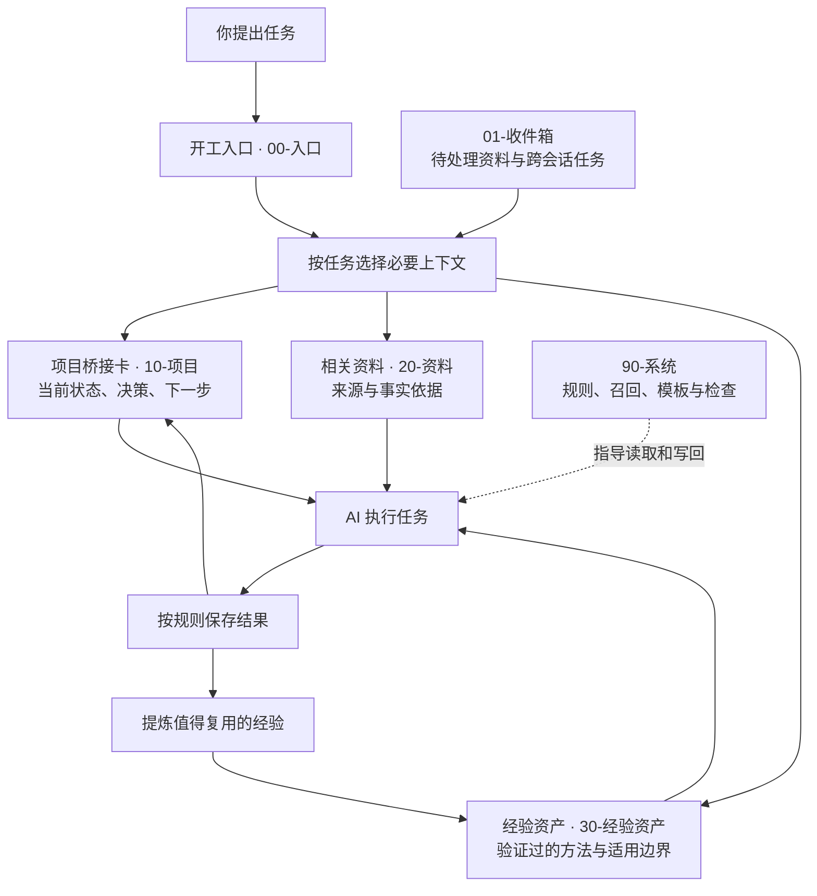

# Obsidian AI Workflow Kit

**让 AI 接着上次的工作做下去，把项目进度、资料和经验留在你自己的电脑里。**

[English](README.en.md) · [体验案例](examples/ai-handoff-demo/walkthrough.md) · [使用指南](docs/10-minute-first-run.zh-CN.md)

[](https://github.com/HiHeiBai/obsidian-ai-workflow-kit/actions/workflows/ci.yml)

每次新开一个 AI 对话，都要重新解释：项目是什么、上次做到哪、资料在哪、哪些决定已经定了。聊完之后，有价值的结论又散落在聊天记录里。

这套项目为 Obsidian 提供一套 **AI 能读懂、能按规则维护的本地知识库结构**：用开工入口找到任务，用项目桥接卡接上进度，用资料和经验支持工作，再把结果保存下来，供下次会话继续使用。

内容都是你能直接阅读、编辑和备份的 Markdown 文件。Obsidian 负责浏览和组织，Codex、Claude Code、Cursor 等能读写本地文件的 AI 负责按工作流执行。无需安装 Obsidian 社区插件；可选动态视图使用 Obsidian 自带的 Bases。

## 它能帮你解决什么

| 日常遇到的问题 | 这套知识库怎么帮助你 |
|---|---|
| 换一个 AI 对话，就得重新介绍项目 | 项目桥接卡保存当前状态、有效决策和下一步，新会话从这里接手 |
| 收藏了很多资料，做事时找不到 | 将资料关联到具体项目，保留来源，通过任务入口找到需要的内容 |
| AI 做完了，结果只留在聊天里 | 按写回规则更新项目事实、产出和进度，让下次有据可查 |
| 同类问题反复解决，经验没积累 | 将验证过的方法保存为经验资产，并接入后续任务的查找入口 |
| 知识库越用越乱，链接和状态失效 | 提供模板、动态视图和只读健康检查，帮助发现断链与字段问题 |

## 架构：一次任务如何变成可复用的积累



AI 先读开工入口，再按任务读取少量相关文件。完成工作后，先更新项目中的事实和产出，再更新供接手的摘要；有复用价值的方法才进入经验资产。规则和模板帮助它区分事实、待确认内容与授权边界。

你可以直接让 AI 推进当前任务。只有需要排队、跨会话或处理阻塞时，才需要单独的任务记录。

## 开始使用：复制这一段，发给 AI

在能读写你电脑文件的 Codex、Claude Code 或 Cursor 中发送：

```text
请帮我部署这个知识库：https://github.com/HiHeiBai/obsidian-ai-workflow-kit 。先读取仓库根目录 AI_DEPLOY.md，并按指引实际完成部署。默认创建完整中文知识库；如果我没指定位置，使用用户文档目录下的“AI知识库”。保留已有内容，不要覆盖已有知识库。完成后验证结果，告诉我知识库的实际路径，并读取开工入口，让当前会话准备好使用它。
```

AI 会负责下载、部署完整中文库、检查文件，并读取开工入口。完成后，它会告诉你实际保存位置；在 Obsidian 中打开这个文件夹，从「首页」开始。已有知识库会先检查并保留原有内容。

## 一个具体例子：接着写上次的发布说明

假设你上次已经整理了发布说明提纲，但还没补齐产品事实。新会话收到“继续这个项目”的任务后：

1. **接上进度**：读取项目桥接卡，知道提纲已完成，还缺发布日期、具体变化、适用人群和限制。
2. **继续工作**：根据你提供的事实完成草稿，保存到项目中，并将下一步更新为“审核草稿”。
3. **留下经验**：把这次验证有效的事实检查方法保存下来，关联到后续写作任务。
4. **下次复用**：换一个项目写发布说明时，AI 能找到检查方法，再核实新项目自己的事实。

这是工作流示例，实际效果取决于项目记录是否准确、是否持续写回。查看[任务接手与经验复用完整案例](examples/ai-handoff-demo/walkthrough.md)。

## 部署后，你会得到什么

日常知识库只有一个首页和六个功能目录：

| 入口或目录 | 你在这里做什么 |
|---|---|
| `首页.md` | 浏览知识库，进入日常工作 |
| `00-入口/` | 让 AI 开工，找到当前任务需要的上下文 |
| `01-收件箱/` | 暂存资料、待办和需要跨会话处理的事项 |
| `10-项目/` | 保存项目进度、决策、产出和接手摘要 |
| `20-资料/` | 保存参考资料，并按流程整理来源 |
| `30-经验资产/` | 积累可以再次使用的方法与经验 |
| `90-系统/` | 存放规则、模板、视图、脚本、使用指南与示例 |

平时从首页进入项目、资料和经验即可，系统内容按需查看。GitHub 中的 [`kit/`](kit/) 就是这套完整中文库；`src/`、`tests/` 和开发文档用于维护项目，AI 部署时不会将它们混入你的知识库。

## 适合怎样使用

适合经常用 AI 推进项目、整理研究资料或创作内容，并希望把长期上下文保存在本地的人。你可以直接检查和修改文件，也可以更换能读写文件的 AI 工具。

这套工作流依靠 AI 读取入口和维护记录来延续上下文。它不会自动赋予所有聊天窗口永久记忆；新会话仍需读取知识库入口，项目状态和经验也需要持续维护。当前为 `0.x` 版本，已有知识库应先检查结构再接入。

## 进一步了解

- [10 分钟首次体验](docs/10-minute-first-run.zh-CN.md)：从首页开始体验项目接手。
- [核心概念](docs/concepts.zh-CN.md)：了解桥接卡、召回和写回规则。
- [模板说明](docs/templates.zh-CN.md)：查看已有模板的用途。
- [手动安装与更新](docs/manual-install.md)：需要自己操作或维护已有库时再阅读。
- [AI 部署说明](AI_DEPLOY.md)：首页提示词交给 AI 执行的完整流程。
- [更新记录](CHANGELOG.md)：查看版本变化。

代码采用 [MIT](LICENSE)，原创文档与模板采用 [CC BY 4.0](docs/legal/content-license.md)。当前版本：`0.13.1`。
